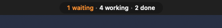
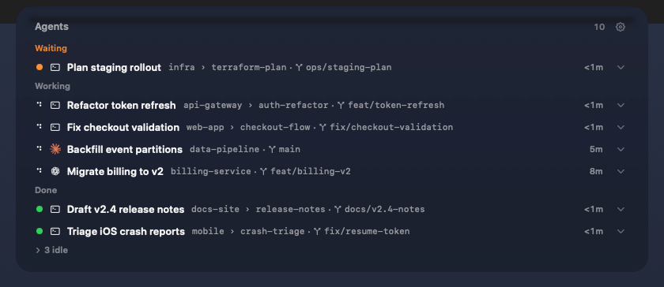
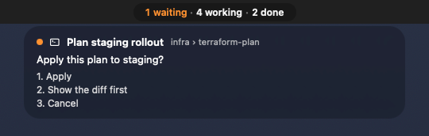

# Agent Island

**Keep an eye on your coding agents without living in their windows.**

A native macOS menu-bar pill for Herdr, Claude Code and Codex Desktop. See who is working, who needs you, and who has finished. Open the board to jump back to an agent. Questions and errors can show a small card and chime; completed work stays quiet.

**Public developer preview · v0.1.0-preview.1 · build from source.** [Release notes](https://github.com/nathanmauro/agent-island-public/releases/tag/v0.1.0-preview.1) · [Report a bug](https://github.com/nathanmauro/agent-island-public/issues) · [Contributing](CONTRIBUTING.md)

Agent Island reads local agent state. It installs no hooks, writes no agent configuration, makes no network requests, and sends no telemetry. Navigation happens when you select an agent. Nothing is posted to Notification Center.

## Screenshots

These use synthetic demo data: every agent, project and branch is invented. `scripts/demo.sh` regenerates the scene.



The pill in the menu bar: one agent waiting, four working, two done.



The board on hover, grouped by state, with each row's workspace › tab, git branch and age.



The card that pops out when an agent asks a question, with its options.


On a notched MacBook display, the counts sit in wings beside the notch.

## What it watches

| Source | Where it reads | What it provides |
|---|---|---|
| **Herdr** (Claude panes in Herdr) | `$HERDR_SOCKET_PATH`, else `~/.config/herdr/herdr.sock` (NDJSON, protocol 22) | Pane status, the blocked question (passive detection reads), the done recap on hover, pane focus |
| **Claude Code outside Herdr** (tmux/salvo, remote-control, Desktop Code tab) | `$CLAUDE_SESSIONS_DIR`, else `~/.claude/sessions/<pid>.json`; `*.key` files are never opened | Interactive sessions, their status and what they wait for. SDK-driven entries (`sdk-*`) are hidden, except Remote Control sessions: `sdk-cli` with a well-formed `bridgeSessionId` |
| **Codex Desktop** | `$CODEX_SESSIONS_DIR`, else `~/.codex/sessions/YYYY/MM/DD/rollout-*.jsonl`, plus the sibling `session_index.jsonl` for titles | Turns, Plan-mode questions, errors, thread titles |

Herdr is authoritative for its own panes: a registry session whose pid is a Herdr pane's foreground process appears once, as the Herdr row. If Herdr is not running, its rows stay on the board dimmed and the pill shows a warning glyph; the other feeds keep working.

## What you see

- **Pill** (primary display, inside the menu bar): counts in the order error, waiting, working, stale, done. Stale means activity is unconfirmed and is never counted as working. Idle and starting agents are not counted. A warning glyph appears when a feed is offline or disabled, or when the Herdr server is older than 0.9.1 (its rows stay live, but a click cannot move the Herdr view); hover it for the reason.
- **Board** (hover or click the pill): groups Waiting, Error, Working, Activity uncertain, Done, and a collapsed "N idle". Rows show a status light, title, subtitle, source glyph, status age and the git branch. Stale rows keep readable text and a static question-mark indicator instead of a working spinner. Herdr and registry activity becomes stale after 30 minutes without a fresh status signal; Codex open turns become stale when Codex is no longer running. Rows can be renamed. When the subtitle repeats the title, it gives way to Claude Desktop, Remote Control, or tmux context when available. Row accessibility labels announce source, status, age and feed warnings; source and row tooltips explain connection problems while preserving questions and recaps. Row actions and rename controls have distinct accessible names. Hovering a done row loads its recap; successful navigation from a row marks that result seen. The island acknowledges its local unread state only after navigation succeeds, and a delayed jump cannot clear a newer result. Herdr also owns server-side seen state, which can change as soon as its focus action succeeds. Activating Codex alone never acknowledges other chats: selecting one row leaves other chats’ results, questions and errors unchanged. The existing first-launch baseline, new-turn reset and 12-hour expiry for completed turns remain in place.
- **Card and chime** (waiting and error only): the card appears on the display under the pointer, shows the question and up to 4 options (or the error line), stays 8 s and stays open while hovered, and says "+N more" when several are pending. The single chime is the system sound "Glass" at volume 0.35 and only ever plays together with a card. A blocked state must hold 1 s; a row peeks once per episode; chimes are at least 3 s apart; nothing peeks for 10 s after launch, a feed reconnect or wake; nothing peeks for the agent you are already looking at. While the board is open the card is hidden and held, so it never covers the board's rows or takes their clicks; it comes back when the board closes and then expires as usual. A question that arrives while the board is open appears on the board without a chime (the chime only plays with a visible card); its card shows when the board closes.
- **Click** a row or the card to jump:
  - Herdr: focus the pane in Herdr, then raise the Ghostty window whose title starts with Herdr's window title (`<host>: <workspace>`), falling back to activating Ghostty.
  - Codex: open `codex://threads/<id>` with Codex.app (explicitly, because ChatGPT.app also claims `codex:`).
  - Claude Desktop: open `claude://code/continue?session=<id>` with the running Claude.app.
  - Claude Remote Control (a session you drive from Claude Desktop, claude.ai or the Claude mobile app): open `claude://claude.ai/epitaxy/<bridgeSessionId>` with the running Claude.app, which shows that exact conversation. Claude.app must be running; otherwise the click fails ("Could not jump to this agent.") instead of falling back to a terminal. Claude.app being frontmost counts as looking at these sessions, as for Claude Desktop.
  - Claude in tmux: activate Ghostty, then `tmux switch-client -t <target>`.
  - If the OS-level jump itself fails (for example Ghostty won't raise), it is recorded into `lastErrorDescription` (visible in the state dump, cleared by a later successful jump) and appended to the transition log as a `jump` record. The board shows "Could not jump to this agent." A failed popup click opens a dialog with **Try Again** and **Close**; retry always targets the agent you originally clicked. If that agent has left the board, the dialog explains that and offers Close.
- **Settings** (gear on the board): Mute chime, Display (Primary display / All displays), Show Codex exec threads.

## Requirements

- A Mac and Xcode 26 or later with its Swift toolchain selected. No third-party package dependencies.
- macOS 14 is the deployment target. CI runs on macOS 26; local checks also run on macOS 27. This preview has not been verified on macOS 14 or Intel hardware. Builds target the host architecture.
- At least one supported agent source. **Herdr and Ghostty are optional for Codex-only use.**
- Herdr integration requires server 0.9.1 or later with protocol 22. Other protocols disable that feed; older servers show a warning because pane navigation may not move the visible Herdr view.
- Herdr and terminal navigation currently use **Ghostty 1.3 or later**. Other terminals are not supported for navigation. Claude Desktop must be running for Desktop and Remote Control links.

## Build and test

```sh
swift build
swift run island-tests                          # custom test runner (not XCTest)
swift run island-tests --filter herdrFeed:      # one area; --filter repeats; case-insensitive prefix match
HERDR_CONTRACT=1 swift run island-tests --filter herdrContract:   # read-only checks against the live Herdr server
scripts/build-app.sh                            # packages .build/AgentIsland.app
```

`scripts/build-app.sh` signs ad hoc by default. Set `SIGN_IDENTITY` to a stable self-signed code-signing certificate if you want macOS to keep the Ghostty Automation permission across rebuilds; with ad hoc signing every rebuild asks again.

## Install from source

This preview is a source release. It does not include a Developer ID signed or notarized app download. Clone the tagged source, inspect it, and build locally:

```sh
git clone --branch v0.1.0-preview.1 --depth 1 https://github.com/nathanmauro/agent-island-public.git
cd agent-island-public
swift --version
scripts/install.sh
```

If `swift` is unavailable, install Xcode and select its developer tools before running the installer. Keep your existing agents' notification settings while evaluating the preview; installation does not change them.

This builds the app, copies it to `~/Applications/AgentIsland.app`, creates `~/.local/state/agent-island`, validates and writes the LaunchAgent `com.nathan.agent-island` into `~/Library/LaunchAgents/com.nathan.agent-island.plist` with absolute paths (launchd does not expand `~`), and (re)loads it with `launchctl bootstrap` and `launchctl kickstart -k`. The LaunchAgent uses `RunAtLoad` and `KeepAlive` with `SuccessfulExit` false, so the island starts at login and restarts after a crash; a clean Quit stays quit. There is no hook step and no login item.

After a Quit (the pill's right-click menu or Settings), the LaunchAgent stays loaded; start the island again with `launchctl kickstart -k gui/$(id -u)/com.nathan.agent-island`. To stop it until the next login, unload the LaunchAgent with `launchctl bootout gui/$(id -u)/com.nathan.agent-island`; after a `bootout`, `kickstart` finds no service, so load it again with `launchctl bootstrap gui/$(id -u) ~/Library/LaunchAgents/com.nathan.agent-island.plist` or rerun `scripts/install.sh`.

To see the plist without installing anything: `scripts/install.sh --render-plist /tmp/agent-island.plist` writes the rendered file and exits; it does not build, copy or call `launchctl`.

macOS may show a one-time "Background Items Added" banner after install. It comes from macOS Background Task Management registering the LaunchAgent, not from the island, and the Notification Center audit does not count it.

The first click that jumps to a Herdr pane asks for permission to control Ghostty (System Settings, Privacy & Security, Automation). Approve it once. A locally built app carries no quarantine flag, so no Gatekeeper prompt is expected.

Check that it runs: `launchctl print gui/$(id -u)/com.nathan.agent-island | head -20`. Crash output goes to `~/.local/state/agent-island/stderr.log`.

## Uninstall

```sh
scripts/uninstall.sh             # unload the LaunchAgent, delete its plist and the app; keep state
scripts/uninstall.sh --purge     # also delete the island's own state files and preferences
scripts/uninstall.sh --dry-run   # print what would run, change nothing (combine with --purge)
```

`--purge` removes `~/Library/Application Support/AgentIsland`, the transition logs and `stderr.log` in `~/.local/state/agent-island`, and the `com.nathan.agent-island` preferences. It never removes the `~/.local/state/agent-island` directory itself, because other tools keep files there.

## Files it writes

| Path | What |
|---|---|
| `~/Library/Application Support/AgentIsland/app.lock` | Single-instance lock |
| `~/Library/Application Support/AgentIsland/session-names.json` | Row renames |
| `~/Library/Application Support/AgentIsland/codex-seen.json` | `{threadId: lastSeenTurnId}`; the first launch records every finished turn as seen so the board does not flood |
| `~/.local/state/agent-island/transitions.jsonl` (+ `.1`, `.2`) | Transition log, rotated at 10 MB, 3 files kept |
| `~/.local/state/agent-island/stderr.log` | LaunchAgent stderr |
| `~/Library/LaunchAgents/com.nathan.agent-island.plist` | Written by `scripts/install.sh` |
| `$AGENT_ISLAND_STATE_DUMP` | Only when that variable is set (tests) |

Session state and transition-log files use owner-only permissions. The installed app and LaunchAgent use normal per-user installation permissions.

## Transition log

One JSON object per line answers "what made that sound?" and "why didn't I see X?". Kinds:

- `state`: a row's display state changed (`from` → `to`; a row that disappeared has `to: "removed"`). Waiting and error rows include their question, truncated to 200 characters. Herdr rows whose pid is also in the Claude registry carry the registry status as `registryStatus` (a soak diagnostic for a later version).
- `peek`: a card was decided (`rule` is `peek.waiting` or `peek.error`).
- `chime`: the chime was decided (`rule: "chime"`), carrying the same truncated question as the peek that triggered it.
- `suppressed`: the policy held something back; `rule` says why (`hold.pending`, `suppressed.episode`, `suppressed.chime-gap`, `suppressed.quiet`, `suppressed.looking`).
- `feed`: a feed's health changed (connect, disconnect, each backoff step, protocol mismatch, unsupported method), or reported a non-health diagnostic (today, Herdr's pane-stream-cap message; marked `rule: "diagnostic"` so it can never be mistaken for a feed's first health report, which also has no `from`).
- `jump`: an OS-level jump you triggered failed; the island skips its local acknowledgment (Herdr may already have applied its server-side focus) (`to` is the truncated error description). Never silent in the log or the state dump (`lastErrorDescription`) — the board itself still shows only a generic error message.

A line is written only when something actually changed: the policy's periodic heartbeat produces no line, and neither does an unchanged republish.

Example (synthetic): `{"from":"working","kind":"state","rowID":"herdr:w1:p1","source":"herdr","to":"waiting","ts":"2027-01-15T08:00:00.250Z"}`

## Environment variables and test seams

| Variable | Effect |
|---|---|
| `HERDR_SOCKET_PATH` | Herdr socket (default `~/.config/herdr/herdr.sock`) |
| `CLAUDE_SESSIONS_DIR` | Claude registry directory (default `~/.claude/sessions`) |
| `CODEX_SESSIONS_DIR` | Codex rollouts directory (default `~/.codex/sessions`); `session_index.jsonl` is read from its parent |
| `AGENT_ISLAND_STATE_DIR` | Puts Application Support files under `<dir>/support` and logs under `<dir>/log` (tests and the end-to-end run) |
| `AGENT_ISLAND_STATE_DUMP` | Writes a JSON state dump (rows, summary, feed health, feed I/O error counts, the last jump failure's description, peek queue, chime count, planned and performed jumps, UI state) to this path on every change, debounced 50 ms and skipped when the content did not actually change. Decode it with a plain `JSONDecoder` |
| `AGENT_ISLAND_JUMP_DRY_RUN=1` | Records planned jump actions instead of running them (no AppleScript, tmux, Herdr focus or URL opens) |
| `AGENT_ISLAND_JUMP_TEST_CONTROL=1` | With dry-run and an explicit state directory, each jump waits up to 60 seconds for `<state>/support/jump-controls/<attempt>.result` (`success` or `failure`, owner-only 0600 regular file). Attempts start at 1; use a fresh directory per run. Missing outcomes time out; unsafe or invalid outcomes fail. No OS actions run. |
| `AGENT_ISLAND_FRONTMOST_BUNDLE_ID` | Pretends this app is frontmost, so "looking at the agent" suppression is deterministic in tests |
| `HERDR_CONTRACT=1` | Enables the read-only live Herdr contract tests |
| `AGENT_ISLAND_BUILD_SCRIPT` | `scripts/install.sh` only: runs this script instead of `scripts/build-app.sh`. The packaging tests point it at a stub; leave it unset for a real install |

Preferences (`defaults read com.nathan.agent-island`; the end-to-end run overrides them with launch arguments such as `-chimeMuted NO`):

| Key | Default | Meaning |
|---|---|---|
| `chimeMuted` | `false` | Cards still appear; no sound |
| `screenSelectionMode` | `primary` | `primary` or `allDisplays` (mirror the pill on every display) |
| `showExecThreads` | `false` | Show Codex `exec` threads |
| `hideWhenEmpty` | `false` | Hide the pill when no agent is tracked |

## Privacy

- Read-only on agent state. The only files it writes are listed above.
- It never opens `~/.claude/sessions/*.key` (messaging-socket secrets); the registry reader accepts `<pid>.json` names only.
- No network access and no telemetry. The only socket it connects to is Herdr's local Unix socket.
- Question text appears on screen in the card. There is no redaction mode in v1.
- The local transition log keeps question text truncated to 200 characters under `~/.local/state/agent-island`.
- It never posts to Notification Center; a static guard test fails the build if any notification API appears in the sources.

## Provenance and license

Agent Island is MIT licensed, with original upstream attribution retained. The built app includes the license texts under `Contents/Resources/Licenses`. It is derived from [Moonglade](https://github.com/ixjosemi/Moonglade) (MIT, © 2026 Josemi Hernandez, commit `be0c5b4`), which supplies the display and window layer, and ports the Herdr request/response codec from [Bantay-TUI](https://github.com/8-BitRhyon/bantay-tui) (MIT, commit `e3e0517`). See `LICENSE`, `NOTICE` and `LICENSES/Bantay-TUI.txt`. Moonglade's own installers were removed right after the import; never run them from history, because they rewrite Claude Code settings.

## Preview limits

- Agent status comes from local integration formats that can change when the agent tools update. This is not a complete approval or permission monitor.
- Multi-monitor popup placement and live deep links across every supported agent/version are not fully verified. The current local display test disagrees with the app about monitor IDs; CI passes on macOS 26.
- There is no automatic updater. To update, check out a later release and rerun the installer. Rebuilding with ad-hoc signing may require granting Ghostty Automation access again.
- Only share redacted diagnostics: row titles, questions, paths and transition logs can contain private project information.

## Verification

`swift run island-e2e --app .build/AgentIsland.app --steps 7 --soak-seconds 0` checks stale registry activity and silent recovery to working through the running app, using isolated fixture data. Native UI checks also cover the separate stale section and the Rename → Cancel/Save action names.

| What | Command | Notes |
|---|---|---|
| Unit and fixture tests | `swift build && swift run island-tests` | Must end `… 0 failed …`. `--filter <prefix>:` runs one area. |
| Static guards (§12.1) | `swift run island-tests --filter guard:` | Scans every file under `Sources/`, comments included. |
| Live Herdr contract (§12.2) | `HERDR_CONTRACT=1 swift run island-tests --filter herdrContract:` | Read-only. Rerun after every Herdr update. |
| Scripted end-to-end (§12.3) | `scripts/e2e.sh` | Builds the bundle, then launches it against a fake Herdr server and temp registry, rollout and state dirs, and asserts on the state dump. Takes about 13 minutes because of the default 600 s soak. `scripts/e2e.sh --soak-seconds 30` is the CI form. `--steps 1,3` runs a subset. |
| Driver self-check | `swift run island-e2e --self-check` | Pure helpers of the E2E driver. |
| Screenshot demo | `scripts/demo.sh [SECONDS] [--display-mode primary\|allDisplays]` | Builds the bundle, then holds it on screen for SECONDS (default 60) against a synthetic scene: fake Herdr panes, a Codex Desktop thread and a Claude registry session, muted, with dry-run jumps. About 12 s after launch the infra pane blocks, and its card shows for 8 s. The app is stopped when the time is up. |
| Soak sampling | `scripts/soak-sample.sh [--live] PID [SECONDS] [INTERVAL]` | `ps %cpu` and `lsof` counts, split into `sockets` (Unix sockets, the island's Herdr connections) and `other`. Passes when the average is < 1 % and the fd spread is ≤ 2 (idle bounds, for the E2E-style soak). `--live` skips that verdict (`verdict=LIVE`, exit 0) for the live trial, where fds follow the Herdr pane count. Exits 2 when the process is gone. |
| Notification Center audit (§12.4) | `python3 scripts/nc-agent-audit.py --since 'YYYY-MM-DD HH:MM'` | Exit 0 clean, 1 agent records, 2 no usernoted database, 3 unreadable (grant Full Disk Access), 64 usage. |
| Trial audit loop | `scripts/nc-audit-trial.sh --since 'YYYY-MM-DD HH:MM'` | Run it in a spare pane. It audits every 10 min and unions records by uuid into `~/.local/state/agent-island/nc-audit.jsonl`. It installs nothing. |

E2E steps: step 0 is the launch quiet guard; 1 Herdr blocked (count, peek, exactly one chime, jump plan); 2 done, error and user-close; 3 Codex `request_user_input` and a registry waiting entry, each with its peek and exactly one chime. Steps 1 and 3 also time each peek against §1.4 criteria 2 and 5: the chime must come within 2 s (2.5 s on CI) of the agent blocking, with the card visible on the display under the pointer. Leave the mouse alone while they run. The other steps: 4 synthetic mouse hover and click-through; 5 CPU/fd soak; 6 Notification Center audit; 7 stale registry activity and silent recovery to working. Step 4 moves the real pointer and needs Accessibility for the terminal; otherwise it prints `SKIP step 4 (grant Accessibility to the terminal)`. Steps 4 and 6 skip on CI. A failing run saves the dump, the transition log and the app log under `.build/e2e-artifacts/<timestamp>/`. `ISLAND_E2E_NEGATIVE_CONTROL=mute` launches the app muted, so steps 1 and 3 must fail. Use it to prove the chime assertions are live.

### Try it

1. Install from source and start a supported agent. Hover or click the pill to open the board.
2. Let a background agent finish. Its Done count should increase without a chime.
3. Select that row. Confirm it opens the intended agent and clears only that result.
4. Check a question or error card using a disposable session. With multiple displays, check the display under the pointer.
5. Try Settings and Quit. After quitting, restart using the LaunchAgent command in the installation section.

The [architecture](docs/ARCHITECTURE.md) describes feeds, state, navigation and privacy boundaries. See [CONTRIBUTING.md](CONTRIBUTING.md) for checks to run before submitting changes.
